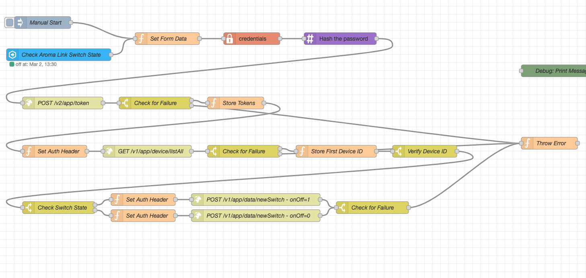

import { Image, Picture } from 'astro:assets';
import ImageLink from '../../components/ImageLink.astro';
import speaker_img_1 from '../assets/aromaLink/speaker_removal_1.png';
import speaker_img_2 from '../assets/aromaLink/speaker_removal_2.png';

#  {frontmatter.title}

Home Assistant Automation to control an Aroma-Link whole-home scented oil diffuser.

Design by Eric Hansen @cablesquirrel

## 📝 Description

After getting tired of constantly refilling and replacing plug-in air fresheners around the house, we decided to make
the jump to a whole-home scent solution. The Aroma-Link unit diffuses scented oil on a schedule and forces the atomized
mixture through a tube into the supply air duct of our HVAC system.

This works great out of the box, and you can configure the duration and schedule of when the unit pumps scent into your
system. However, the unit has no way of knowing when your HVAC system is actually running, so any scent supplied to the
ductwork while the HVAC system isn't running is wasted.

Inspired by [This Post](https://community.home-assistant.io/t/whole-home-cold-air-scent-diffuser-automation-is-possible-without-crappy-apps/541137/41)
on the home-assitant community forums, I came up with an automation to control the Aroma-Link device via its API. This would
allow me to turn the unit on when my smart thermostat calls for the fan to turn on, and then shut the unit back off after the
fan shuts down.

## ☑️ Basic Requirements

- Aroma-Link Smart Scent Air Machine Bluetooth & WiFi
- Registered user account on the Aroma-Link app
- Home Assistant with the Node-RED Add-on installed
    - Credentials Library `npm install node-red-contrib-credentials`
    - MD5 Library `npm install node-red-contrib-md5`
- Smart thermostat integrated with Home Assistant

## 🌎 Exploring the Aroma-Link API

The Aroma-Link devices use an ESP32-based microcontroller and connect back to a central server using unencrypted HTTP requests.

### 🔐 Credentials

Credentials to access the API are the same as your username and password used to log into the Aroma-Link app on your mobile device.
However, the password is first hashed using `MD5` before being sent to the remote server. This appears to be some attempt at obfuscation
since the data is sent in plain text.

You can use an online MD5 hash generator, or a terminal with the `md5` utility to calculate your password hash.

> Note: The `-n` flag is needed to tell `echo` not to add a newline before sending the text to standard out. This makes a difference
> in the hashed password.

```bash
echo -n "secretPa55w0rd" | md5
```

Results:

```text
aa4cedfde5a1c4b13579470cf995648a
```

#### 🪙 Session Token

Once you have your username and hashed password, you can request a session token from the server. This is needed for all subsequent calls
to the API.

You will need to make a `POST` request to the `/v2/app/token` endpoint with your username and password hash

```bash
curl -X POST http://www.aroma-link.com/v2/app/token -d "userName=myUser&password=aa4cedfde5a1c4b13579470cf995648a"
```

```json
{
  "code": 200,
  "msg": "OK",
  "data": {
    "accessToken": "eyJhbGciOiJIUzI1NiIsInppcCI6IkRFRiJ9.....",
    "refreshToken": "eyJhbGciOiJIUzI1NiIsInppcCI6IkRFRiJ9.....",
    "accessTokenValidity": 212800000,
    "refreshTokenValidity": 299200000,
    "id": 12345,
    "email": null,
    "resources": null
  }
}
```

In the returned JSON data, you will need to store your `accessToken` for future calls. This will be added to a header called
`access_token`.

You will also need to store the `id` which corresponds with your particular account ID.

### 🧳 Device Listing

Before we can control a device that is associated with our account, we first need to get a list of devices that we can control.

Make a `GET` request to the `/v1/app/device/listAll/{Account ID}` endpoint to retrieve the list of devices.

```bash
curl -X GET http://www.aroma-link.com/v1/app/device/listAll/12345 -H "access_token: eyJhbGciOiJIUzI1NiIsInppcCI6IkRFRiJ9...."
```

```json
{
  "code": 200,
  "msg": "OK",
  "data": [
    {
      "id": 98765,
      "text": "default group",
      "parentId": null,
      "type": "group",
      "hasParent": false,
      "hasChildren": true,
        <....>
      "children": [
        {
          "id": 867530,
          "text": "Some Location",
          "parentId": 98765,
          "type": "device",
          "hasParent": false,
          "hasChildren": false,
          "onlineStatus": 1,
          "btMac": null,
          "deviceNo": "<MAC ADDRESS>",
          "netType": "WIFI",
          "deviceType": "01",
            <....>
        }
      ],
      "levels": 0
    }
  ]
}
```

Returned as JSON will be the groups on the account, along with the children (devices) in each group. For this automation, I blindly
grab the first group and first child device inside of the group as I only have 1 device on the account.

Store the ID of the child device for future calls.

### 🔄 Controlling the Device State

We're now ready to turn the device on or off.

To do so, we make a `POST` request to the `/v1/app/data/newSwitch?deviceId={Device ID}&userId={User ID}&onOff={State}` endpoint.

Set `onOff` to `1` to turn the Aroma-Link device on
Set `onOff` to `0` to turn the Aroma-Link device off

> The `userId` field appears to be mostly ignored in testing. However, you should use the ID that was returned when you requested a
> token in the steps earlier.

```bash
curl -X POST http://www.aroma-link.com/v1/app/data/newSwitch\?deviceId\=867530\&userId\=12345\&onOff\=1 -H "access_token: eyJhbGciOiJIUzI1NiIsInppcCI6IkRFRiJ9...."
```

```json
{
  "code": 200,
  "msg": "OK"
}
```

## 🤖 Building the Process Flow in Node-RED

Now that we're familiar with the API for the device, we can use a custom flow created in Node-RED to handle the steps required to make
a change to the state of our Aroma-Link device.

This is what the flow I created looks like:

[💾 Download as JSON](/files/aroma_link_automation.json)



Flow Principles:

- Start Points
    - Manual Start
        - Type: (inject node) - Used to test the automation by manually triggering the flow
    - Check Aroma-Link Switch State
        - Type: (events: state) - Used to monitor the virtual switch that represents the status of the HVAC fan

- Flow
    - Set Form data
        - Type: (function node) - Sets the `Content-Type` and `Accept` headers to be used when making API calls
    - Credentials
        - Type: (credentials node) - Stores the username and password securely in the flow
    - Hash the password
        - Type: (md5 node) - Hashes the password that was exported from the credentials using `MD5`
    - POST /v2/app/token
        - Type: (http request node) - Sends the credentials to the API and retrieves the session token
    - Check for Failure
        - Type: (switch node) - Checks the HTTP request return for success or Failure
            - Throws an error if failure detected
    - Store Tokens
        - Type: (function node) - Stores the returned session token for later use
    - Set Auth Header
        - Type: (function node) - Sets a header for authentication using the session token to be used in next API call
    - GET /v1/app/device/listAll
        - Type: (http request node) - Gets the device listing from the API
    - Check for Failure
        - Type: (switch node) - Checks the HTTP request return for success or Failure
            - Throws an error if failure detected
    - Store First Device ID
        - Type: (function node) - Stores the ID of the first located device in the data returned in the call to `listAll`
    - Verify Device ID
        - Type: (switch node) - Checks the make sure a proper integer device ID was stored
    - Check Switch State
        - Type: (switch node) - Checks the current switch state to determine next API call
    - Set Auth Header
        - Type: (function node) - Sets a header for authentication using the session token to be used in next API call
    - POST /v1/app/data/newSwitch - onOff=XXX
        - Type: (http request node) - Calls the remote API and requests the status of the device be changed to the requested state
    - Check for Failure
        - Type: (switch node) - Checks the HTTP request return for success or Failure
            - Throws an error if failure detected

## 🏗️ Building a Basic Automation

> Our Node-RED flow will watch this device and trigger a flow execution when the state changes.

As a generic representation of the state of the Aroma-Link device, I created an `input_boolean` in my `configuration.yaml` file.

```yaml
input_boolean:
  aroma_link_switch:
    name: "Aroma Link Switch"
    icon: mdi:toggle-switch
```

This allows me to treat it like any other device and turn it on and off using standard automations in the Home Assistant UI.

I created 2 automations, one to turn the Aroma-Link device on when my Ecobee thermostat changes state from `idle`, and another
to turn the Aroma-Link device off when the state changes back to `idle`.

```yaml
alias: Turn on scent when HVAC fan running
description: ""
triggers:
  - trigger: state
    entity_id:
      - climate.ecobee
    attribute: hvac_action
    from: idle
conditions: []
actions:
  - action: input_boolean.turn_on
    metadata: {}
    data: {}
    target:
      entity_id: input_boolean.aroma_link_switch
mode: single
```

```yaml
alias: Turn off scent when HVAC fan stopped
description: ""
triggers:
  - trigger: state
    entity_id:
      - climate.ecobee
    attribute: hvac_action
    to: idle
conditions: []
actions:
  - action: input_boolean.turn_off
    metadata: {}
    data: {}
    target:
      entity_id: input_boolean.aroma_link_switch
mode: single
```

## 🔕 Silencing the Noise

One thing you will notice, is that when a command is sent to turn the unit on or off, the internal speaker will beep
to indicate a state change. In my case, this was highly distracting as the unit lives in my HVAC closet attached to my
living room. The sound was clearly audible and was testing my sanity.

I couldn't find a way to disable the sound in software, so I took the manual approach of desoldering the speaker from
the control board of the device.

<Image src={speaker_img_1} alt="Speaker to be removed" width="800" quality="high" />

<Image src={speaker_img_2} alt="Speaker to be removed" width="800" quality="high" />
