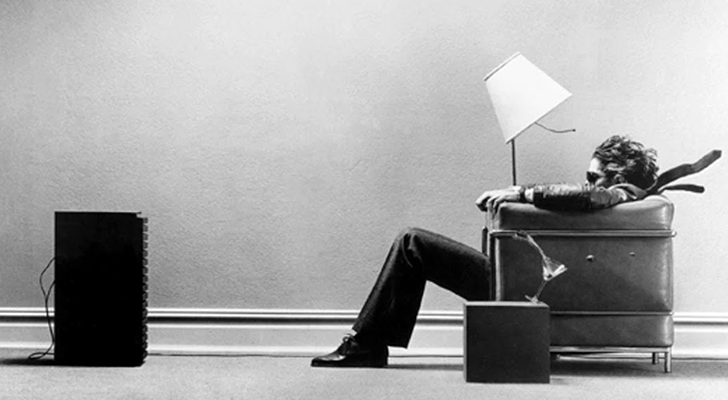
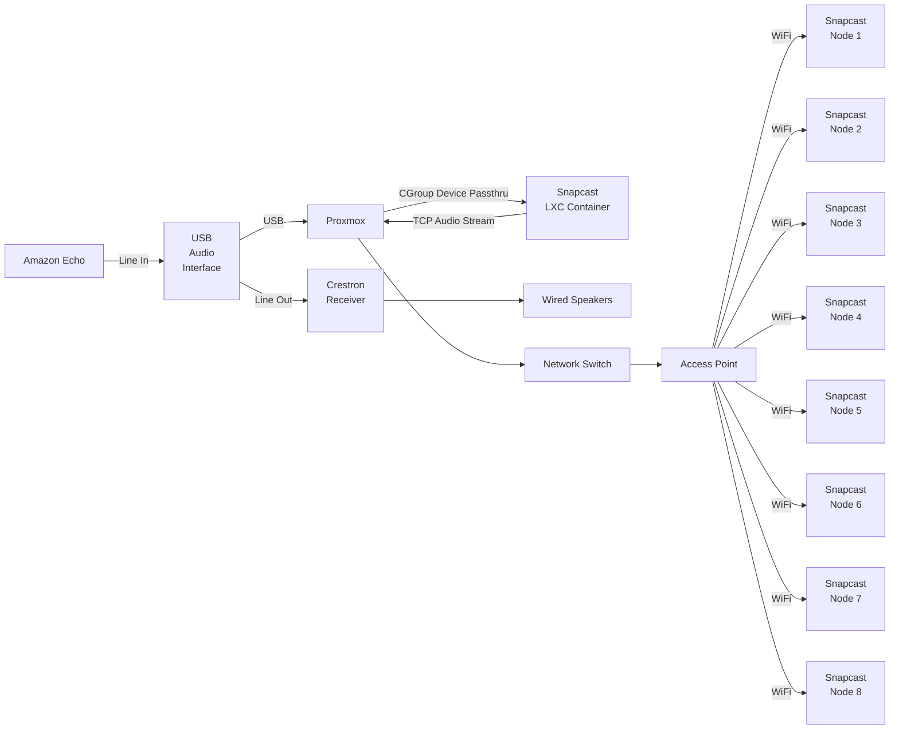

import { Image, Picture } from 'astro:assets';
import ImageLink from '../../components/ImageLink.astro';

import img_antenna_placement from "../assets/speakerStakes/antenna_placement.jpg";
import img_assembly_overview from "../assets/speakerStakes/assembly_overview.jpg";
import img_assembly_overview_2 from "../assets/speakerStakes/assembly_overview_2.jpg";
import img_hampton_bay_box_back from "../assets/speakerStakes/hampton_bay_box_back.jpg";
import img_hampton_bay_box_side from "../assets/speakerStakes/hampton_bay_box_side.jpg";
import img_hampton_bay_box from "../assets/speakerStakes/hampton_bay_box.jpg";
import img_original_insides from "../assets/speakerStakes/original_insides.jpg";
import img_pcb_3w from "../assets/speakerStakes/pcb_3w.jpg";
import img_pcb_5w from "../assets/speakerStakes/pcb_5w.jpg";
import img_pcb_assembled_3w from "../assets/speakerStakes/pcb_assembled_3w.jpg";
import img_pcb_assembled_3w_2 from "../assets/speakerStakes/pcb_assembled_3w_2.jpg";
import img_pcb_assembled_3w_3 from "../assets/speakerStakes/pcb_assembled_3w_3.jpg";
import img_pcb_assembled_5w from "../assets/speakerStakes/pcb_assembled_5w.jpg";
import img_pcb_assembled_5w_2 from "../assets/speakerStakes/pcb_assembled_5w_2.jpg";
import img_power_supply from "../assets/speakerStakes/power_supply.png";
import img_top_module_1 from "../assets/speakerStakes/top_module_1.jpg";
import img_top_module_2 from "../assets/speakerStakes/top_module_2.jpg";
import img_bottom_module_1 from "../assets/speakerStakes/bottom_module_1.jpg";
import img_bottom_module_2 from "../assets/speakerStakes/bottom_module_2.jpg";
import img_bottom_module_3 from "../assets/speakerStakes/bottom_module_3.jpg";
import img_battery_1 from "../assets/speakerStakes/battery_1.jpg";
import img_battery_2 from "../assets/speakerStakes/battery_2.jpg";
import img_battery_3 from "../assets/speakerStakes/battery_3.jpg";
import img_speaker_1 from "../assets/speakerStakes/speaker_1.jpg";
import img_speaker_2 from "../assets/speakerStakes/speaker_2.jpg";
import img_speaker_swap_1 from "../assets/speakerStakes/speaker_swap_1.jpg";
import img_speaker_swap_2 from "../assets/speakerStakes/speaker_swap_2.jpg";
import img_speaker_swap_3 from "../assets/speakerStakes/speaker_swap_3.jpg";
import img_prototype from "../assets/speakerStakes/prototype.jpg";
import img_paper_prototype from "../assets/speakerStakes/paper_prototype.jpg";
import img_kicad_v1_1 from "../assets/speakerStakes/kicad_v1_1.png";
import img_kicad_v1_2 from "../assets/speakerStakes/kicad_v1_2.png";
import img_kicad_v2_1 from "../assets/speakerStakes/kicad_v2_1.png";
import img_kicad_v2_2 from "../assets/speakerStakes/kicad_v2_2.png";
import img_rectifier from "../assets/speakerStakes/rectifier.jpg";
import img_home_assistant_1 from "../assets/speakerStakes/home_assistant_1.jpg";
import img_home_assistant_2 from "../assets/speakerStakes/home_assistant_2.jpg";
import img_sound_card from "../assets/speakerStakes/sound_card.jpg";

export const imageWidth = "800";
export const imageHalvesWidth = "380";
export const imageThirdsWidth = "240";

# {frontmatter.title}

Repurposing bluetooth outdoor landscape speakers as wifi Snapcast nodes for backyard audio streaming.

Design by Eric Hansen @cablesquirrel

## 📝 Description

Back in 2018, we wanted a way to have music playing throughout our backyard. There were some requirements we had
such as the speakers needed to be able to be powered from our existing landscape lighting and they needed to receive
the audio signal wirelessly.

During a trip to Home Depot, we spotted these Hampton Bay bluetooth speakers that were priced at around $30 each. They
were powered from standard 12V AC landscape lighting and had built in Bluetooth. Not only that, but they allow you to
connect up to 8 of them together wirelessly.

<table>
    <tr>
        <td>
            <ImageLink src={img_hampton_bay_box} alt="Retail Packaging" width={imageThirdsWidth} quality="mid" />
        </td>
        <td>
            <ImageLink src={img_hampton_bay_box_back} alt="Retail Packaging" width={imageThirdsWidth} quality="mid" />
        </td>
        <td>
            <ImageLink src={img_hampton_bay_box_side} alt="Retail Packaging" width={imageThirdsWidth} quality="mid" />
        </td>
    </tr>
</table>

These speakers gave us several years of decent sounding audio in our yard, but they weren't without their issues and
shortcomings.

## 🪲 Issues

The 8-speaker mesh is simultaneously the best and worst feature of these devices. If you can get it paired, it seems to
work without much issue. However, the pairing process is complicated requiring putting the 'master' unit into pairing mode
and then running to every other speaker and pressing a button to connect it. Seems easy enough, but when you have 8 of
these devices and have to run to all of them, the pairing process times out before you get them all connected. We found
the best way around this was to have some friends over and give everyone a couple speakers to push the button on once the
main speaker is ready.

The speakers would work fine for months, but inevitably 1 by 1 they begin to lose their pairing. We got tired of having to
redo the process and ended up only using 2 or 3 of the speakers.

The other issue we had was being able to stream the same media to both our wired outdoor speakers under the patio and these
yard stakes. Our wired speakers were louder and more enjoyable than the stakes alone, so eventually we stopped using them
altogether.

I began searching for a solution with the least amount of effort required to implement. I thought that maybe some sort of
base station Bluetooth transmitter that could stream to all the units with each being in master mode might work. Not finding
anything off the shelf that would work, I decided it was time for a teardown of the existing units to find something to hack.

## 🧨 The Teardown

Inside each unit sits 2 printed circuit boards. One placed at the top above the speaker, and another in the base of the unit.

<ImageLink src={img_original_insides} alt="Teardown" width={imageWidth} quality="mid" />

The board at the top above the speaker is labeled `Lightning_speaker BT V1.5`. This board is in use when the unit is in `master` mode.
It utilizes a single **CSR BlueCore® CSR8615 System-on-Chip**. Information on this chip can be found
[on Qualcomm's website](https://www.qualcomm.com/audio/products/csr8615) as they acquired CSR in August of 2015. It's connected to the
base module with a single flat flex cable.

<table>
    <tr>
        <td>
            <ImageLink src={img_top_module_1} alt="Top module" width={imageHalvesWidth} quality="mid" />
        </td>
        <td>
            <ImageLink src={img_top_module_2} alt="Top module" width={imageHalvesWidth} quality="mid" />
        </td>
        <td>
        </td>
    </tr>
</table>

The board at the bottom of the unit contains the rectifier, buck converter, charging circuit, and audio amplifier. It also contains a
System-on-chip branded as **Cheerstar CS869DL** for connecting multiple `slave` units back to the `master` over a 2.4GHz backhaul.

<table>
    <tr>
        <td>
            <ImageLink src={img_bottom_module_1} alt="Top module" width={imageThirdsWidth} quality="mid" />
        </td>
        <td>
            <ImageLink src={img_bottom_module_2} alt="Top module" width={imageThirdsWidth} quality="mid" />
        </td>
        <td>
            <ImageLink src={img_bottom_module_3} alt="Top module" width={imageThirdsWidth} quality="mid" />
        </td>
    </tr>
</table>

The device uses an 18650 lithium-ion cell for battery backup. This allows for music play during the day when the landscape lighting
AC power is normally unavailable. The cell is marked as 2200mAh and having a manufacturer of `Great Power Battery(ZHUHAI)CO.,Ltd` - Made in China.
Surprisingly, the cell does include a protection circuit consisting of an unbranded control chip and 2 **HD8205A** N-Channel MOSFETs.

<table>
    <tr>
        <td>
            <ImageLink src={img_battery_1} alt="Battery" width={imageThirdsWidth} quality="mid" />
        </td>
        <td>
            <ImageLink src={img_battery_2} alt="Battery" width={imageThirdsWidth} quality="mid" />
        </td>
        <td>
            <ImageLink src={img_battery_3} alt="Battery" width={imageThirdsWidth} quality="mid" />
        </td>
    </tr>
</table>

The speaker connects to the bottom board in the base of the unit. It's marked as being capable of 8 watts at 4Ω
and has a diameter of 2.5 inches.
After years of being exposed to the elements they didn't look too horrible, but some did have sizable tears
in the paper.

<table>
    <tr>
        <td>
            <ImageLink src={img_speaker_1} alt="Original Speaker" width={imageThirdsWidth} quality="mid" />
        </td>
        <td>
            <ImageLink src={img_speaker_2} alt="Original Speaker" width={imageThirdsWidth} quality="mid" />
        </td>
    </tr>
</table>

## 🧪 Research & Tinkering

Looking online, I stumbled across a project that seemed interesting to me. A library designed to stream audio from multiple sources
to multiple targets across an IP Network. The project supports a large variety of hardware, and the client library can run on embedded
devices like the ESP32. It seemed as though this would be the ideal solution for sending audio to both wired and wireless devices
anywhere in my network.

> The project is called [Snapcast](https://github.com/snapcast/snapcast) and is open source on GitHub.


Back to looking at the construction of the speakers, I decided I would do some testing to see if it's possible to keep all the existing
components but inject my own line-level audio. The goal would be to use the existing amplifier circuit from the bottom circuit board
and run each speaker in `master` mode so that the 2.4GHz mesh was not active. Then, streaming audio from an ESP32 running as a [Snapcast client](https://github.com/snapcast/snapcast/blob/develop/doc/Overview.png) could be inserted using some jumper wires to the test pads labeled **L+** and **L-** on the top board.

However, after spending a couple hours playing with it I couldn't figure out how to keep the bottom board from going into
standby mode when injecting an external audio signal into the top board. My best guess is that it has something to do with the
pin labeled **TONG**. When the top board is active, it supplies a constant 1.8V to the bottom board, along with some other communication.
I'm sure I could've kept playing with it and probing pins to figure it out, but it seemed as though it wasn't worth keeping the
original electronics.

I decided to begin plan B - gut each speaker and replace everything inside with my own design. So, I got to work!

## 🖇️ Prototyping

I first created a simple breadboard prototype with a spare ESP32 Devkit board and a [MAX98357A](https://www.adafruit.com/product/3006) clone from Amazon.
The MAX98357A contains an I2S DAC and 3-Watt amplifier on a convenient breakout board. I compiled the Snapcast client library with some help from Claude Code
and loaded it onto the test board.

For the Snapcast server, I installed it inside a LXC container on my [Proxmox](https://www.proxmox.com/en/products/proxmox-virtual-environment/overview) setup. I chose some music
from my library to AirPlay to the Snapcast server, and with a couple of clicks to set the source, we were streaming!

<ImageLink src={img_prototype} alt="Breadboard Prototype" width={imageWidth} quality="mid" />

With the prototype working, I put together a list of components I would need to actually be able to retrofit one of these existing speakers.

| Component | Description | Link to Buy |
| -- | -- | -- |
| AC Rectifier and Buck Converter | Needed to bring the 12VAC landscape lighting power down to 5VDC | [Buy on Amazon](https://www.amazon.com/dp/B094ZTG5S8) |
| ESP32-S3 Dev Board | I decided to go with the Seeed Studio XIAO ESP32S3 dev boards. They've got a compact footprint, an IPEX/IPX external antenna connector, and 8MB of PSRAM that can be used in Snapcast for larger audio buffers | [Buy on Amazon](https://www.amazon.com/dp/B0DJ6NQFKX) |
| MAX98357A I2S DAC + AMP | I2S DAC with built in 3-Watt amplifier | [Buy on Amazon](https://www.amazon.com/dp/B0FHWB5VFW) |

## 🎨 PCB Design

I thought about jamming all the components into the top portion of the speaker housing and using jumper wires to connect everything together... but then I remembered I had
8 of these things to build. It would be hard to maintain any sort of consistency in the build, so the right call was to design a PCB that I could mount everything on to.

I had never created a PCB before, but I had seen a number of YouTube videos explaining how easy and low-cost it is to get boards made these days, so I figure with
a little time invested, I could do it too. I downloaded [KiCad](https://www.kicad.org/) and watched some tutorials on YouTube from the channel [HTM Workshop](https://www.youtube.com/watch?v=vLnu21fS22s&list=PLUOaI24LpvQPls1Ru_qECJrENwzD7XImd) that were absolutely fantastic.

I added a diode on the power input to protect the ESP32 from reverse polarity. However, I made the conscious decision to run the MAX board direct from the 5V supply as I didn't want to risk
the power feed to the ESP32 sagging under full volume due to the voltage drop of the diode.

Within a few hours I had what I believed to be a working board design. To make sure everything fit, I printed the design to scale on paper and lined the components up with their outlines.

<table>
    <tr>
        <td>
            <ImageLink src={img_kicad_v1_1} alt="Kicad Version 1" width={imageThirdsWidth} quality="mid" />
        </td>
        <td>
            <ImageLink src={img_kicad_v1_2} alt="Kicad Version 1" width={imageThirdsWidth} quality="mid" />
        </td>
        <td>
            <ImageLink src={img_paper_prototype} alt="Kicad Version 1 Printed" width={imageThirdsWidth} quality="mid" />
        </td>
    </tr>
</table>

With everything looking promising, I submitted my order to [JLCPCB](https://jlcpcb.com/) and waited patiently for them to arrive.

> 3-Watt Speaker Stake KiCad Design Files: [https://github.com/cablesquirrel/snapcast-speaker-stake/tree/master/hardware/v1](https://github.com/cablesquirrel/snapcast-speaker-stake/tree/master/hardware/v1)

## 🏗️ Board Assembly

About a week later I had my boards in hand, ready to assemble. Everything looked good at first glance, except one minor detail...

On one of the last couple of tweaks I made to the board, I accidentally removed the center mounting hole and didn't catch it. As a matter of fact, I slapped the board name and version right over
where the hole was supposed to go.

D'oh!

No worries, though. The boards drilled pretty easy with a sharp bit and some patience.

<ImageLink src={img_pcb_3w} alt="3W Board Unassembled" width={imageWidth} quality="mid" />

I soldered all the components into place on the first board, and with my fingers crossed, powered it up.

I flashed the firmware onto the new ESP32 and ran the [Improv WiFi Setup Tool](https://www.improv-wifi.com/). After a successful connection to my wireless network
I mounted the board in the speaker housing and finished the assembly.

<table>
    <tr>
        <td>
            <ImageLink src={img_pcb_assembled_3w} alt="PCB v1 Assembled" width={imageThirdsWidth} quality="mid" />
        </td>
        <td>
            <ImageLink src={img_pcb_assembled_3w_2} alt="PCB v1 Assembled" width={imageThirdsWidth} quality="mid" />
        </td>
        <td>
            <ImageLink src={img_pcb_assembled_3w_3} alt="PCB v1 Assembled" width={imageThirdsWidth} quality="mid" />
        </td>
    </tr>
</table>

I placed the speaker out in the yard and powered everything up. It seemed to work well, I couldn't quite get the volume level out of the speaker that I expected. At night,
when there was no ambient noise from cars traveling the highway, the volume was fine. However, during the day I felt the speaker was hard to hear.

I was a bit disappointed, but still overall happy that it worked at all. It was time for some changes.

## ↩️ Back to the Drawing Board

I wasn't giving up. With a little more research I came up with a new design. This time I separated the DAC and audio amplifier into discrete components. This
would let me run a 5-watt amplifier instead of being bound by the integrated 3-watt amp in the MAX chip. 5-watts appeared to be the largest amplifier I could easily
obtain that runs from a 5 volt supply and fits easily within the footprint of my board. Here was my revised component list for a 5-watt capable version.

| Component | Description | Link to Buy |
| -- | -- | -- |
| AC Rectifier and Buck Converter | Converts 12VAC to 5VDC | [Buy on Amazon](https://www.amazon.com/dp/B094ZTG5S8) |
| ESP32-S3 Dev Board | ESP32 Dev Board with 8MB PSRAM and external antenna connection | [Buy on Amazon](https://www.amazon.com/dp/B0DJ6NQFKX) |
| PCM5102 | Standalone I2S DAC with line-level output | [Buy on Amazon](https://www.amazon.com/dp/B08YNJGSN4) |
| CH05D | 5-Watt Single Channel Amplifier | [Buy on Amazon](https://www.amazon.com/dp/B0F6YBYMWY) |

In the same manner as the first time, I ordered the components and then prototyped everything up on a breadboard to make sure it solves the issues I was looking to solve. I
was pleasantly surprised by just how loud this configuration was compared to the previous design.



I drafted a new PCB design that fit within the same footprint. I made some improvements such as adding vias to tie the front and rear ground planes together at the edges, as well as adding back the mounting hole that I missed the first time. Just like the first design, I left the reverse polarity protection diode protecting the ESP32 and the DAC. The amplifier taps power directly from the
input terminals to prevent voltage sag due to drops across the diode under load.

<table>
    <tr>
        <td>
            <ImageLink src={img_kicad_v2_1} alt="Kicad Version 2" width={imageHalvesWidth} quality="mid" />
        </td>
        <td>
            <ImageLink src={img_kicad_v2_2} alt="Kicad Version 2" width={imageHalvesWidth} quality="mid" />
        </td>
    </tr>
</table>

> 5-Watt Speaker Stake KiCad Design Files: [https://github.com/cablesquirrel/snapcast-speaker-stake/tree/master/hardware/v2.0.1](https://github.com/cablesquirrel/snapcast-speaker-stake/tree/master/hardware/v2.0.1)

## 🏗️ Board Assembly - Round 2

After another week of waiting, my boards arrived at my doorstep. These looked perfect, even including a mounting hole this time 🤣.

I began work on assembling the components on the new boards. Just like the first time, I noticed a mistake I made that I hadn't caught during the design phase. The
footprint for the CH05D Amplifier module was mirrored. Luckily this just meant the chips on the board had to face down with the "CH05D" silkscreen facing up. I had
a huge sigh of relief when I realized the boards weren't trash.

<ImageLink src={img_pcb_5w} alt="5W Board Unassembled" width={imageWidth} quality="mid" />

<table>
    <tr>
        <td>
            <ImageLink src={img_pcb_assembled_5w} alt="PCB v2 Assembled" width={imageHalvesWidth} quality="mid" />
        </td>
        <td>
            <ImageLink src={img_pcb_assembled_5w_2} alt="PCB v2 Assembled" width={imageHalvesWidth} quality="mid" />
        </td>
    </tr>
</table>

I powered up the first test speaker and was happy to hear that everything worked as expected and the volume level was night and day compared to the 3-watt version.

## 🖌️ Finishing Touches

With a design I was content with, I decided to do a bit of a refresh and replace the speakers with ones that weren't exposed to the element for 8 years. I found
[these speakers on Amazon](https://www.amazon.com/dp/B07H2TBKM6) that matched the originals. They have a 2.5" diameter, square mounting pattern, 4-Ohm impedance,
and a maximum wattage of 15-watts.

> 💡 Tip: The replacement speakers have a plastic ring for sealing. The original speakers use a rubber gasket. The plastic ring can be removed from the new speakers
> (shown in the pictures below).

<table>
    <tr>
        <td>
            <ImageLink src={img_speaker_swap_1} alt="Speaker swap" width={imageThirdsWidth} quality="mid" />
        </td>
        <td>
            <ImageLink src={img_speaker_swap_2} alt="Speaker swap" width={imageThirdsWidth} quality="mid" />
        </td>
        <td>
            <ImageLink src={img_speaker_swap_3} alt="Speaker swap" width={imageThirdsWidth} quality="mid" />
        </td>
    </tr>
</table>

The rectifier/regulator fits in the bottom section of the speaker and can use the original mounting holes if you turn it so they line up.

> 💡 Tip: The regulator voltage comes set around ~4.2VDC. Make sure you adjust it to 5V using a multimeter before connecting to your new boards.

> 💡 Tip: A drop of super glue or nail polish can be used to keep the adjust potentiometer from turning once you have your voltage set.

<ImageLink src={img_rectifier} alt="Rectifier" width={imageWidth} quality="mid" />

The completed assembly stack-up is shown below.

<ImageLink src={img_assembly_overview} alt="Completed assembly" width={imageWidth} quality="mid" />

## 🧑‍💻 Code Resources

The code used, and the instructions to compile it can be found on this project's GitHub:

[https://github.com/cablesquirrel/snapcast-speaker-stake](https://github.com/cablesquirrel/snapcast-speaker-stake)

> 🚧 Disclaimer: AI was used in locating and patching bugs in the Snapcast library impacting over-the-air updates and software volume control. Patches are
> included in the repo and can be applied at your discretion.

## 🏠 Home Assistant Integration

One of the great features of Snapcast is the integration with Home Assistant. Once connected to your Snapcast server, the integration will mirror the
discovered Snapcast clients as media player devices within Home Assistant.

For example, I have a custom audio dashboard created with widgets for each of my 8 speaker stakes in the back yard, along with a master volume slider
that adjusts the volume of all the speakers together. I've also got an interactive map with each speaker positioned according to where it's installed.
Clicking its icon brings up its media settings.

<table>
    <tr>
        <td>
            <ImageLink src={img_home_assistant_1} alt="Home Assistant" width={imageHalvesWidth} quality="mid" />
        </td>
        <td>
            <ImageLink src={img_home_assistant_2} alt="Home Assistant" width={imageHalvesWidth} quality="mid" />
        </td>
    </tr>
</table>

## 🔌 Extra Inputs

In addition to enabling AirPlay, Snapcast is capable of using other types of streams or even physical audio devices as sources. In order to bring in audio from a physical
source, I needed to add an audio interface (fancy USB sound card) to the setup.

I found [this USB Audio Interface](https://www.amazon.com/dp/B0CNVY89PF) on Amazon for a cheap price, but it had great reviews and was Linux compatible.

<ImageLink src={img_sound_card} alt="Rectifier" width={imageWidth} quality="mid" />

My Proxmox server immediately picked it up.

```bash
root@proxmox:/etc/lxc# lsusb -t
/:  Bus 001.Port 001: Dev 001, Class=root_hub, Driver=ehci-pci/2p, 480M
    |__ Port 001: Dev 002, If 0, Class=Hub, Driver=hub/6p, 480M
        |__ Port 004: Dev 004, If 0, Class=Audio, Driver=snd-usb-audio, 480M
        |__ Port 004: Dev 004, If 1, Class=Audio, Driver=snd-usb-audio, 480M
        |__ Port 004: Dev 004, If 2, Class=Audio, Driver=snd-usb-audio, 480M
        |__ Port 004: Dev 004, If 3, Class=Audio, Driver=snd-usb-audio, 480M
        |__ Port 004: Dev 004, If 4, Class=Audio, Driver=snd-usb-audio, 480M
        |__ Port 004: Dev 004, If 5, Class=Audio, Driver=snd-usb-audio, 480M
        |__ Port 006: Dev 003, If 0, Class=Hub, Driver=hub/6p, 480M
```

All the sub-devices (2 microphones, line-in, line-out, and stereo out) were detected.

```bash
root@proxmox:/etc/lxc# ls -l /dev/snd
total 0
drwxr-xr-x 2 root root       60 Sep 14 15:57 by-id
drwxr-xr-x 2 root root       80 Sep 14 15:57 by-path
crw-rw---- 1 root audio 116,  7 Sep 14 15:57 controlC0
crw-rw---- 1 root audio 116,  3 Sep 14 16:13 pcmC0D0c
crw-rw---- 1 root audio 116,  2 Sep 14 15:57 pcmC0D0p
crw-rw---- 1 root audio 116,  5 Sep 14 16:52 pcmC0D1c
crw-rw---- 1 root audio 116,  4 Sep 14 15:57 pcmC0D1p
crw-rw---- 1 root audio 116,  6 Sep 14 16:13 pcmC0D2c
crw-rw---- 1 root audio 116,  1 Sep 13 02:57 seq
crw-rw---- 1 root audio 116, 33 Sep 14 15:57 timer
```

In the LXC container config, 2 cgroup2 devices are passed through. `116.*` is the audio interface and all its sub-components(ports). `189.*` is the host's
USB controller.

```ini
root@proxmox:/etc/lxc# cat /etc/pve/lxc/109.conf
arch: amd64
cores: 2
hostname: snapserver
memory: 2048
net0: name=eth0,bridge=vmbr0,firewall=1,gw=x.x.x.x,hwaddr=XX:XX:XX:XX:XX:XX,ip=X.X.X.X/24,tag=XX,type=veth
onboot: 1
ostype: debian
rootfs: vm_storage_1:vm-109-disk-0,size=8G
swap: 512
lxc.cgroup2.devices.allow: c 116:* rwm
lxc.cgroup2.devices.allow: c 189:* rwm
lxc.mount.entry: /dev/snd dev/snd none bind,optional,create=dir
lxc.mount.entry: /dev/bus/usb dev/bus/usb none bind,optional,create=dir
```

In our home, we have a Crestron Adagio sound system with an Audio Expander that powers speakers on our back patio and over by our pond. In order to have the same source
play in sync without the delay introduced by going through snapcast and the network, I needed to make sure that the Crestron system was receiving audio **from** Snapcast
and not from a separate source. This gives control over delay adjustments in Snapcast should I need them.

The overall topology looks loosely like this:



So far, so good. Time will tell how reliable this setup is, and I'm hoping to expand it.
